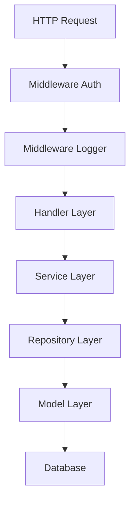

# Studio Service 项目结构介绍

基于您提供的文件目录树，这是一个典型的 Go Web 服务项目，采用了现代化的项目布局结构。以下是详细的结构介绍：

## 📁 项目整体架构

```
Studio Service/
├── api/                    # 📋 API规范和文档 (OpenAPI/Swagger/Proto)
├── benchmark/              # 🚀 性能测试和基准测试
├── bin/                    # 🔧 编译后的可执行文件
├── build/                  # 🐳 构建配置 (Dockerfile/Makefile)
├── cmd/
│   └── api/               # 🚀 应用程序主入口 (main.go/server.go)
├── internal/
│   └── configs/           # ⚙️ 私有配置管理 (环境变量/动态配置)
├── pkg/
│   ├── common/            # 🛠️ 公共组件 (错误码/常量/响应格式)
│   ├── handler/           # 🌐 HTTP处理器 (路由/控制器)
│   ├── middleware/        # 🔄 中间件 (认证/日志/CORS等)
│   ├── model/             # 📊 数据模型 (结构体/实体定义)
│   ├── repository/        # 💾 数据访问层 (数据库操作/缓存)
│   ├── service/           # 💼 业务逻辑层 (核心业务处理)
│   └── utils/             # 🔧 工具函数 (并发/信号/框架工具)
├── test/                   # 🧪 测试文件和测试数据
├── types/                  # 📝 全局类型定义和接口
├── go.mod                  # 📦 Go模块依赖管理
└── go.sum                  # 🔒 依赖版本锁定文件
```

## 📂 目录详细说明

### 🚀 **应用程序入口** (`cmd/`)
```
cmd/
└── api/
    ├── app/
    │   └── server.go     # 服务器启动和配置逻辑
    └── main.go           # 程序主入口点
```
- **用途**: 应用程序的启动入口
- **特点**: 每个子目录代表一个可执行程序
- **职责**: 初始化服务、启动 HTTP 服务器、处理启动参数

### 🔧 **构建和部署** (`build/`, `bin/`)
```
build/
├── Dockerfile            # Docker 容器化配置
└── Makefile             # 构建脚本和任务定义

bin/
└── api                  # 编译后的可执行文件
```
- **build/**: 包含构建、打包、部署相关的配置文件
- **bin/**: 存放编译生成的二进制可执行文件

### 📋 **API 规范** (`api/`)
```
api/                     # API 规范和文档
```
- **用途**: 存放 API 接口定义、OpenAPI/Swagger 规范、Protocol Buffers 文件
- **特点**: 与具体实现分离，支持 API-first 开发

### 🏗️ **内部实现** (`internal/`)
```
internal/
└── configs/
    └── webapp/
        ├── config.go     # 配置结构定义
        ├── dynamic.go    # 动态配置管理
        └── env.go        # 环境变量处理
```
- **特点**: 私有代码，不能被外部项目导入
- **configs/webapp/**: Web 应用特定的配置管理

### 📦 **可复用代码库** (`pkg/`)

这是项目的核心业务代码，采用分层架构：

#### 🌐 **Web 层**
```
pkg/handler/
├── laboratory/          # 实验室相关的 HTTP 处理器
└── routes.go           # 路由配置和注册
```

#### 🔄 **中间件层**
```
pkg/middleware/
├── auth/               # 认证中间件
└── logger/             # 日志中间件
    ├── log.go          # 基础日志功能
    ├── otel_log.go     # OpenTelemetry 日志集成
    └── shortcut.go     # 日志快捷方法
```

#### 💼 **业务逻辑层**
```
pkg/service/
└── __init__.go         # 业务逻辑层说明文件
```

#### 💾 **数据访问层**
```
pkg/repository/         # 数据访问层 (Repository 模式)
```

#### 📊 **数据模型层**
```
pkg/model/              # 数据模型和结构体定义
```

#### 🛠️ **公共组件**
```
pkg/common/
├── code/
│   └── errCode.go      # 错误码定义
├── constant/
│   └── constant.go     # 系统常量
└── response.go         # 统一响应格式

pkg/utils/
├── concurrent.go       # 并发处理工具
├── gin.go             # Gin 框架相关工具
└── signal.go          # 系统信号处理
```

### 🧪 **测试和性能** (`test/`, `benchmark/`)
```
test/                   # 测试文件
benchmark/              # 性能测试和基准测试
```

### 📝 **类型定义** (`types/`)
```
types/                  # 全局类型定义和接口
```

## 🏛️ 项目架构特点

### 1. **分层架构**
```
┌─────────────────┐
│   Handler Layer │  ← HTTP 请求处理
├─────────────────┤
│   Service Layer │  ← 业务逻辑处理
├─────────────────┤
│ Repository Layer│  ← 数据访问层
├─────────────────┤
│   Model Layer   │  ← 数据模型定义
└─────────────────┘
```

### 2. **模块化设计**
- **高内聚**: 相关功能组织在同一模块内
- **低耦合**: 模块间通过接口交互
- **可复用**: pkg/ 下的代码可被外部项目导入

### 3. **现代化特性**
- **容器化**: Docker 支持
- **可观测性**: OpenTelemetry 集成
- **中间件**: 认证、日志等横切关注点
- **优雅关闭**: 信号处理机制

## 🔄 典型的请求流程



## 📋 开发建议

1. **遵循分层**: 严格按照 Handler → Service → Repository → Model 的调用链
2. **接口优先**: 定义接口后再实现，便于测试和替换
3. **错误处理**: 使用统一的错误码和响应格式
4. **日志记录**: 利用已有的日志中间件进行追踪
5. **配置管理**: 使用 internal/configs 进行环境相关配置

这个项目结构非常适合构建可维护、可扩展的 Web 服务，既支持团队协作，又便于后续的微服务拆分。