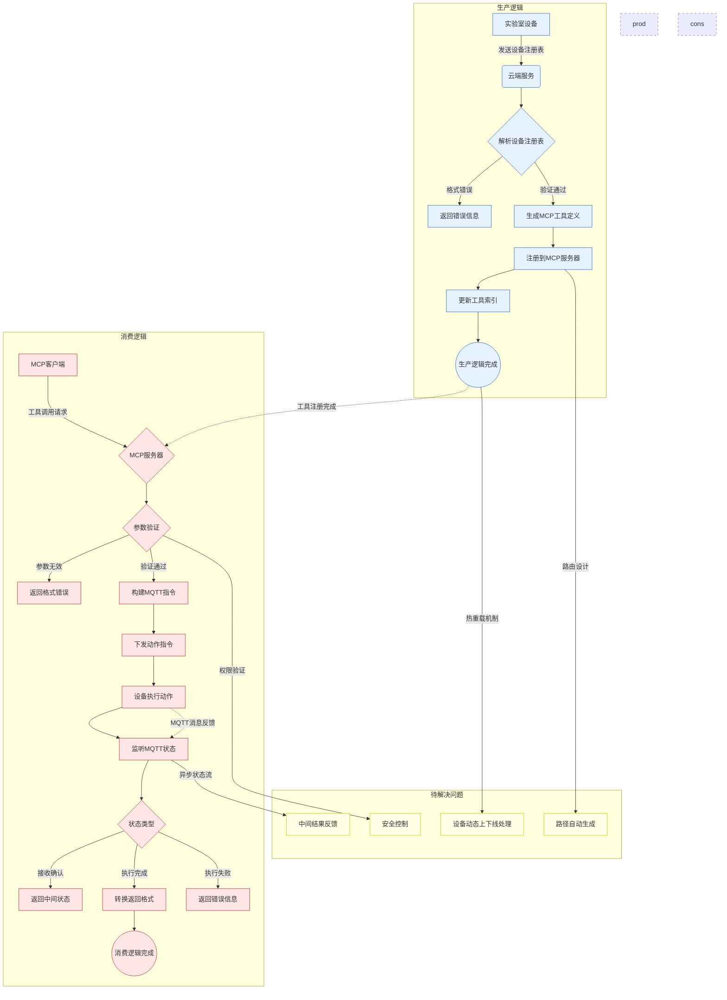

export const metadata = {
    title: "实验室端设备 MCP 的设计",
    description: "Uni-Lab-OS 实验室端侧设备 MCP 化"
}

# 实验室端设备 MCP 的设计

## 生产逻辑（设备注册与 MCP 工具生成）

实验室端侧设备通过设备注册表信息将完整的设备信息发送到云端，具体包括：

1. **设备基础信息**：设备名称、型号、版本、状态等
2. **设备动作描述**：每个动作的功能说明、使用场景
3. **动作参数定义**：参数名称、类型、范围、默认值、是否必需
4. **动作返回值定义**：返回数据结构、状态码、错误信息格式【取决于下面的第 3 点】

云端接收到设备描述后，自动执行以下流程：

1. **解析设备注册表**：验证数据格式和完整性
2. **生成 MCP 工具定义**：将设备动作转换为标准 MCP tools 格式
3. **注册到 MCP 服务器**：在 MCP 服务器中发布可用工具【是否需要返回值定义，帮助 LLM 理解】
4. **更新工具索引**：维护设备到 MCP 工具的映射关系

### 待解决的问题

- **Django 集成问题**：如何在 Django 中让 MCP 路由与主路由集成？
- **路由抽象化**：MCP 路由的抽象化方法设计，能够根据接收到的注册表信息自动创建 MCP 路由，需要一个抽象基类
- **路径设计**：MCP 路由的路径命名规范和层级结构，同时要支持跨实验室路由的动作发布
- **热重载**：设备动作添加时 MCP Server 支持热加载动作；设备离线或故障时如何处理已注册的 MCP 工具？

## 消费逻辑（MCP 工具调用与设备控制）

当 LLM 通过 MCP 客户端调用设备动作工具时，系统执行以下流程：

1. **接收 MCP 调用**：服务端接收 LLM 的工具调用请求
2. **参数验证**：验证调用参数的有效性和完整性
3. **构建 MQTT 指令**：将 MCP 调用转换为设备可识别的 MQTT 消息
4. **下发动作指令**：通过 MQTT 向目标设备发送指令（包含动作路由与参数）
5. **等待设备响应**：监听设备的执行状态和结果返回（端侧持续向 MQTT Status 发布状态）
6. **处理执行结果**：将设备返回的结果转换为 MCP 响应格式（连续流 or 最终结果？）

### 异步执行状态管理

由于设备动作执行需要时间，系统需要处理以下执行阶段：

- **指令接收确认**：设备确认收到并开始执行指令
- **执行中状态**：设备正在执行动作的中间状态
- **执行完成**：设备完成动作并返回最终结果
- **执行失败**：设备执行失败并返回错误信息

### 可能的问题

- **异步状态反馈**：如何在 MCP 客户端的单次请求中体现"动作已接收正在运行"与"动作已完成"两个阶段？【确认下 MCP 是否支持中间信息】
- **超时处理**：设备长时间无响应时的超时机制和重试策略
- **错误恢复**：网络中断或设备故障时的错误恢复机制【二期】
- **安全性**：设备动作调用的权限验证和访问控制
- **监控和日志**：动作执行的监控、日志记录和审计追踪【二期】

以下是当前的实验室注册表数据模型，以及一个例子。

## 设备注册表数据模型 {{ tag: 'POST', label: '/v1/lab/<lab_id>/registry/' }}

<Row>
  <Col>

    这个端点接受所有的 MCP 信息

    ### Optional attributes

    <Properties>
      <Property name="limit" type="integer">
        Limit the number of groups returned.
      </Property>
      <Property name="archived" type="boolean">
        Only show groups that are archived when set to `true`.
      </Property>
    </Properties>

  </Col>
  <Col sticky>

    <CodeGroup title="Registry" tag="Example" label="Device Registry">

    ```yaml {{ title: 'Example1' }}
    hotel.thermo_orbitor_rs2_hotel:
        class:
            action_value_mappings: {}
            module: unilabos.devices.resource_container.container:HotelContainer
            status_types:
            rotation: String
            type: python
        description: Thermo Orbitor RS2 Hotel
        handles: []
        icon: ''
        init_param_schema:
            config:
            properties:
                device_config:
                type: object
                rotation:
                type: object
            required:
            - rotation
            - device_config
            type: object
            data:
            properties:
                rotation:
                type: string
            required:
            - rotation
            type: object
        model:
            mesh: thermo_orbitor_rs2_hotel
            type: device
    ```

   ```yaml {{ title: 'Example2' }}
    curl -G https://api.protocol.chat/v1/groups \
      -H "Authorization: Bearer {token}" \
      -d limit=10
    ```

    </CodeGroup>

  </Col>
</Row>

为了实现更完整的 MCP 加载，需要将注册表设计为更完整的结构：


...

新添加的字段：

...

## 流程图一览

整体对 Device Action 生成 MCP 的逻辑由流程图概括如下：



